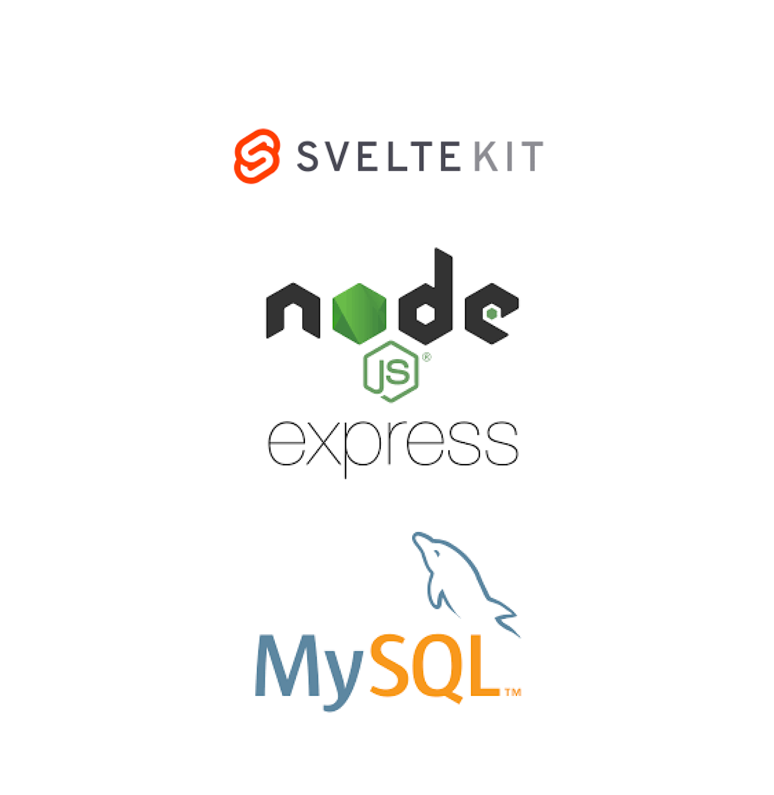
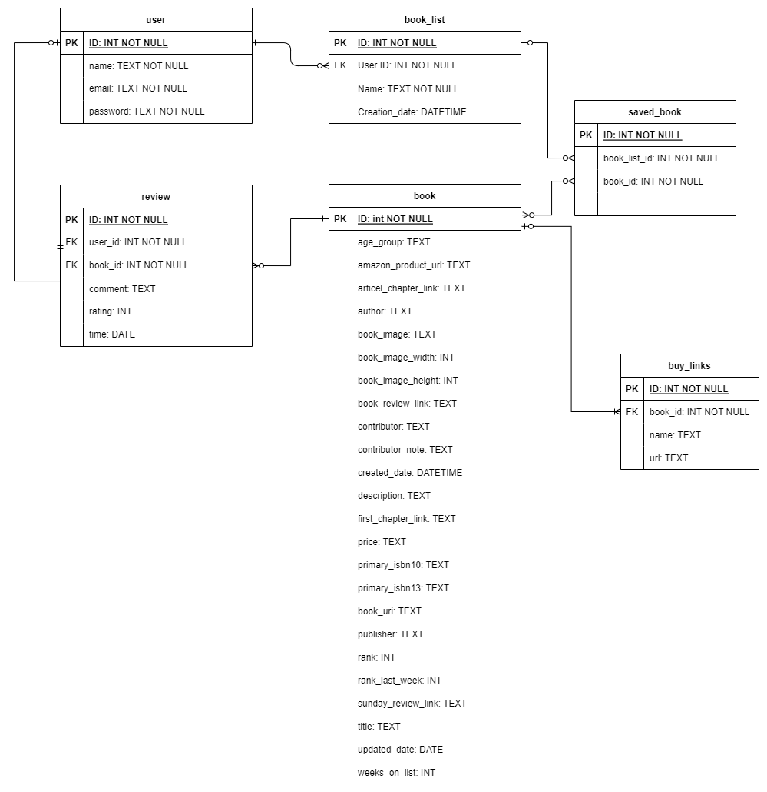

# Bevezető

# A rendszer célja

Egy Sveltekit frontend és mysql node js backend rendszer ami könyveket tud megjeleníteni és eltárolni a felhasználóknak. A felhasználók be tudnak jelentkezni, lekérni könyveket, és kedvenceket menteni.

# Projekt terv

A csapat 4 fős. 1 ember a backendet csinálja, 2-en a frontendet, és 1 emeber pedig ellenőrzi a folyamatokat, és támogatást nyújt kérdéses esetekben. A csapatból mindenki felelősséggel tartozik azért, hogy a projekt időben elkészüljön és hogy az általuk elvállalt feladatok, melyek az oldal működését biztosítják jól, megfelelően működjenek. A projekt menedzserek leellenőrzik a tagok által elkészített feladatokat, hogy azok tényleg ellátják-e a funkcióikat, ha nem, akkor annak a csapattagnak a figyelmét felhívják arra, hogy nem az elvárt módon működik az adott feladat. Ezen kívül még tanáccsal látják el a tagokat, valamint újabb feladatokat adnak ki.

# Üzleti folyamatok modellje

A projekt egy könyv rendszerező alkalmazás lesz, ahol rendszerezni tudják a kedvenc könyveiket a felhasználók.
Üzleti szereplők

A rendszert regisztrálás nélkül is lehet használni. Ekkor a vendég csak a kezdőlapot tudja elérni, azon belül csak a keresés és részletes keresés menüpontokhoz van hozzáférése, illetve láthatja a könyvekhez tartozó értékeléseket, kommenteket. 
Regisztrált üzleti szereplők az ügyfelek. Ők igénybe vehetik az összes funkciót ingyenesen.

A ’Belépés’ menüpontra kattintva megjelenik a ’Felhasználó név’ és ’Jelszó’ beviteli űrlap. A mezők kitöltése után a ’Belépés’ gombra Ha az azonosítás sikeres, akkor a felhasználó belépett és megjelenik a jogosultságának megfelelő főoldal.Ha nem sikerül az azonosítás, hibaüzenet jelenik meg.

Üzleti folyamatok ügyfelek számára:
Az ügyfél regisztrálása a rendszerben: A még nem regisztrált ügyfél a 'belépés' menüpontra kattintva eljut a bejelentkező oldalra ahol képes a regisztrációra a 'regisztráció' menüpontra kattintva.
Itt meg kell adnia a 'Felhasználónév, emailcím, jelszó, jelszó még egyszer' adatokat. Ezzel létrehozva az ügyfél személyes profilját az adatbázisba

Ügyfél törlése a rendszerből
Az ügyfél bejelentkezés után a 'profil' menüpontra kattintva megérkezik a személyes profil oldalra. Itt lehetősége van törölni a profilját a 'profil törlése' menüpontra kattintva

Könyv értékelése
Az ügyfélnek lehetősége van a könyveket értékelni.
Bejelentkezés után egy könyvre kattintva megjelenik a könyv profilja ahol az 'értékelés' menüpontra kattintva értékelheti a könyvet.

Könyv mentése saját listába.
Az ügyfél képes kedvenc könyveket lementeni a listájába. Bejelentkezés után egy könyvre kattintva megjelenik a könyv profilja ahol a 'kedvenc' menüpont kipipálásával hozzá adhatja a kedvenc listájához az adott könyvet.

Könyv kommentelése
Az ügyfél képes kedvenc könyvekhez kommentet írni. Bejelentkezés után egy könyvre kattintva megjelenik a könyv profilja ahol a 'kommentek' menüpontra kattintva előjön az 'új komment írása' ahova megírhatja kommentjét majd az 'elküld' gomb megírásával hozzá adhatja kommentjét a könyvhöz.

# Követelmények

# Funkcionális terv

## Funkcionális követelmények:

+ A főoldal tartalmazza a legfrissebb könyveket
+ Kategóriák szerinti könyv megjelenítés 
+ Részletes könyv oldal: Ez az oldal tartalmazza a kiválasztott könyv részletes információit. Ezek az információk a könyv címe, borítókép, rövid tartalmi összefoglaló, szerző neve, kiadás éve, vásárlói értékelések, vélemények és linkek, ahol a könyvet meg lehet vásárolni.
+ Regisztrációs lehetőség az oldal felhasználóinak 
+ Regisztrációt visszaigazoló email: a felhasználó kap egy igazoló emailt a regisztrációjáról
+ Bejelentkezés: bejelentkezési felület, ahol a felhasználó a felhasználóneve és jelszava megadásával be tud lépni
+ Könyveket lehessen értekelni 
+ Könyveket lehessen kommentelni
+ Könyveket le lehessen menteni listákba

## Nem funkcionális követelmények:

+ A weboldalt interneten lehet elérni.
+  Az oldal legyen könnyen navigálható és egyszerűen használható.
+  Az oldal legyen gyors és megbízható.
+ Az oldal legyen reszponzív és minden eszközön megfelelően jelenjen meg.
+ A témára vonatkozó adatokat tartalmazza, azaz ne jelenjenek meg oda nem illő tartalmak.
+ A funkciók a leírtaknak megfelelően működjenek.
+ Könnyen karbantartható és bővíthető forráskód

# Fizikai környezet

# Adatbázis terv

# Tesztterv

A rendszerterv szerint implementált szoftver tesztelésének célja, hogy ellenőrizze az üzleti folyamatok modellje című pontban meghatározott helyes, specifikáció szerinti lefutását, valamint hogy a kliens webes felület felhasználóbarát módon és reszponzívan jelenik meg valamennyi eszközön, és használható különböző hardver és szoftverkörnyezetben.

A tesztelés során használt kiszolgáló hardver koonfigurációja a telepítés során használt hardverrel kompatibilis, teljesítményben (processzor, operatív memória, háttértár) nem tér el jelentősen. Telepítéskor igény szerint biztosítunk ehhez szükséges hardvert is.

A tesztelés során a használt hardverek a napjainkban elterjedt hardverkonfigurációjú PC-k illetve laptopok, melyeken a leggyakrabban használt böngészőkön (Google Chrome, Mozzila Firefox, Microsoft Edge) teszteljük a rendszert az alábbiakban részletezettek szerint.

A minimum hardverkonfiguráció:

A futtatáshoz:
Processzor: minimum 1 GHz - 2 GHz dual core vagy ennél jobb.
Memória: minimum 512MB - 1GB, vagy nagyobb forgalmú oldal esetében több ajánlott.
Tárhely: 200 MB, valamint a tárolni kívánt adatok mennyiségétől függően ettől több.
A weboldal megtekintéséhez:
Egy böngészőt futtatni képes PC, mobiltelefon, vagy tablet
A tesztelés során az üzleti folyamatokhoz tartozó különböző forgatókönyvek eredményét vizsgáljuk. Amennyiben az elvártnak megfelelő eredményt kapjuk, a teszteset sikeresnek tekinthető, ellentkező esetben a hibát rögzítjük a tesztjegyzőkönyvben. Ezt követően a feljegyzett hibákat javítjuk a szoftverben, és újbóli tesztelésnek vetjük alá a rendszert.

A rendszer alábbiakban leírt tesztelésének előfeltétele, hogy az adatbázisban phpMyAdmin segítségével felvegyünk egy első adminisztrátori jogosultsággal rendelkező felhasználót a felhasználók táblába. Felhasználónév: admin, a további adatok a fejlesztő-tesztelő személyes adatai lesznek. Ezzel belépve tudjuk tesztelni az adminisztrátori jogosultsággal rendelkező felhasználók kivételes funkcióit.

## 5. Üzleti folyamatok modellje

